<div align="center">

# 🛍️ BuySpot Store - Your Ultimate E-Commerce Experience

<p align="center">


</p>
</div>

**`BuySpot`** Store is a dynamic e-commerce platform built with core web technologies (**`HTML`**, **`CSS`**, **`JavaScript`**) to provide a seamless and intuitive shopping experience.  
It allows users to browse **`253 products`**, add items to **`cart`** or **`favorites`**, submit **`reviews`**, manage **`profiles`**, and complete **`purchases`**.

With a **`responsive UI`**, and interactive features like **`search autocomplete`** and **`product sliders`**, BuySpot delivers a modern shopping solution.

<!-- Screenshots Section -->
<div align="center">

  <!-- Row 1 -->
  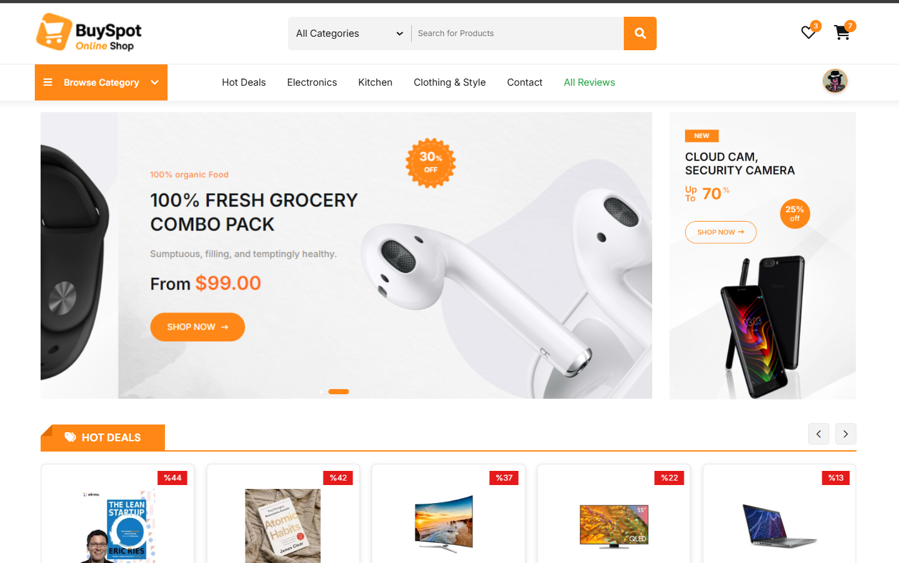
  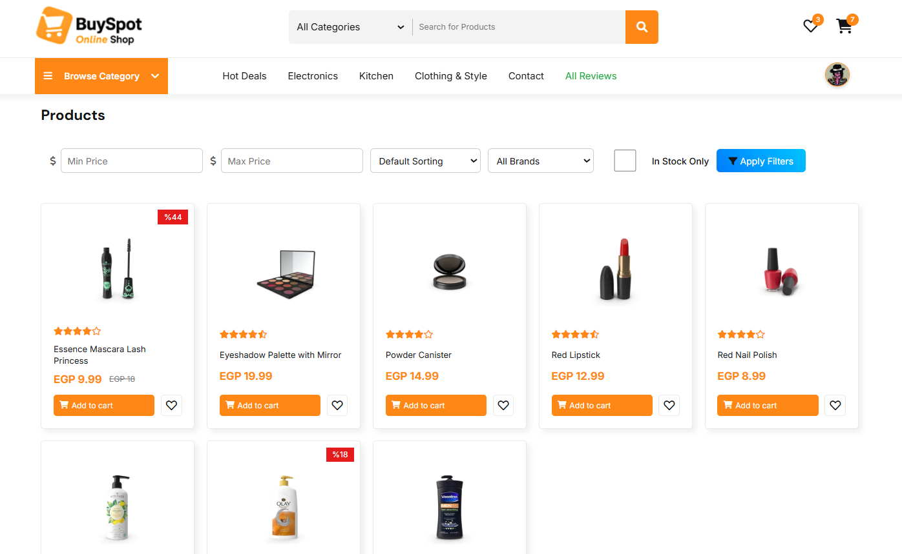
  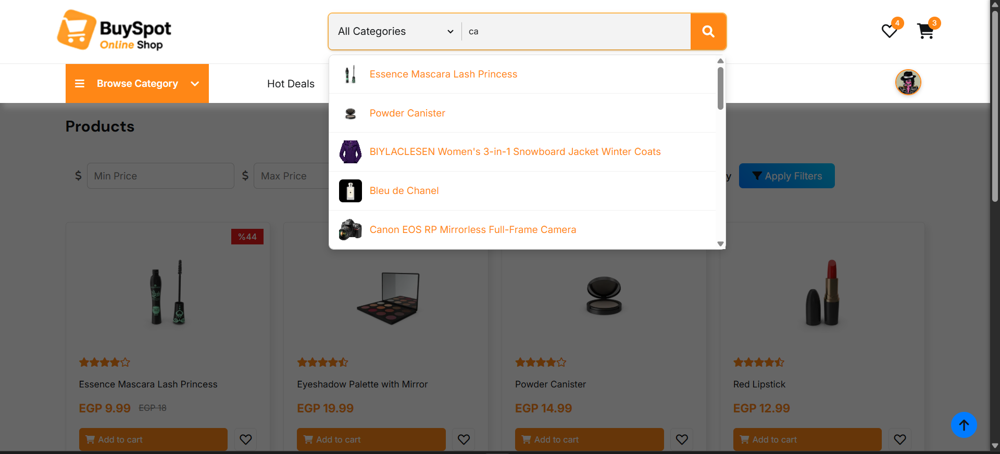

  <!-- Row 2 -->
  <br>
  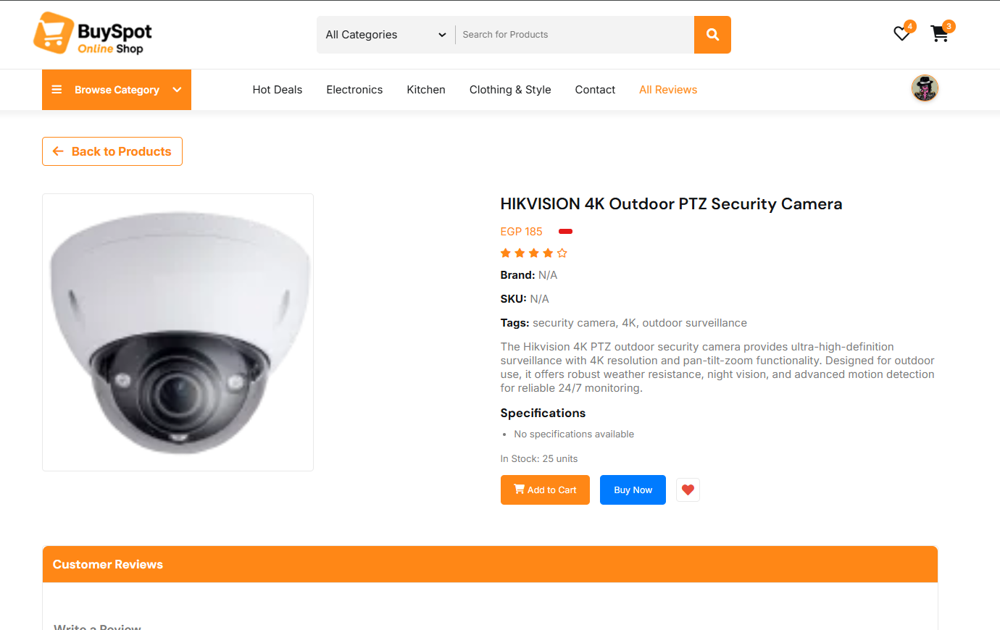
  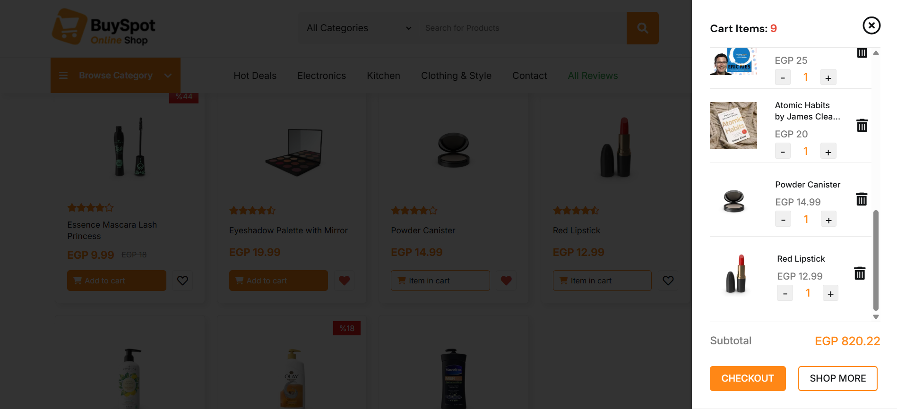
  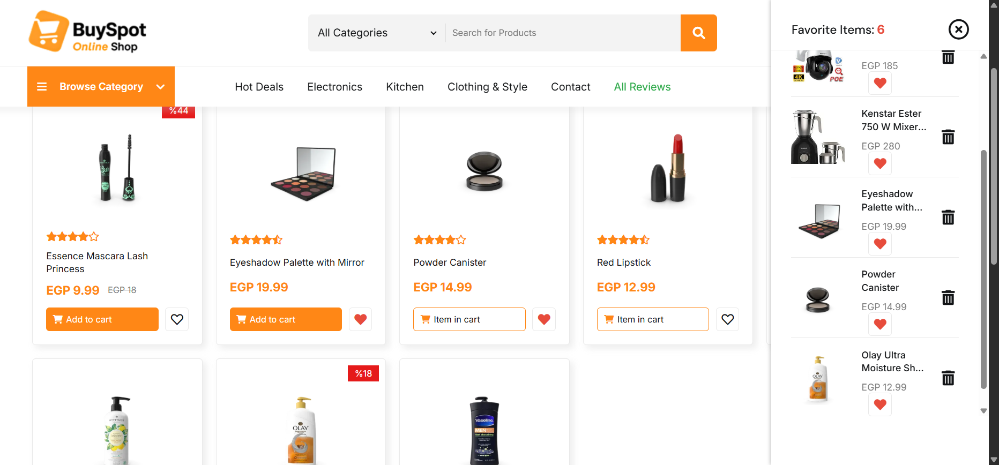

  <!-- Row 3 -->
  <br>
  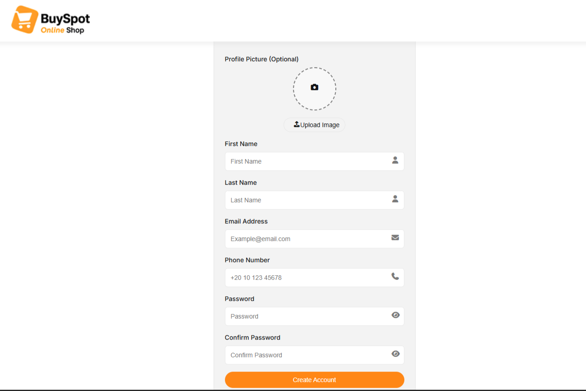
  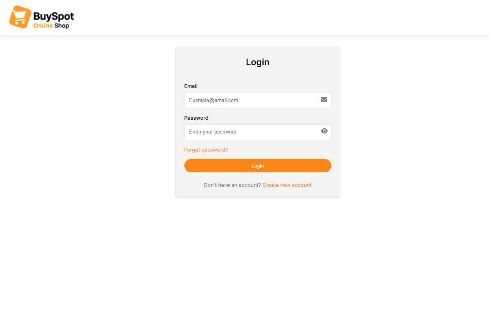
  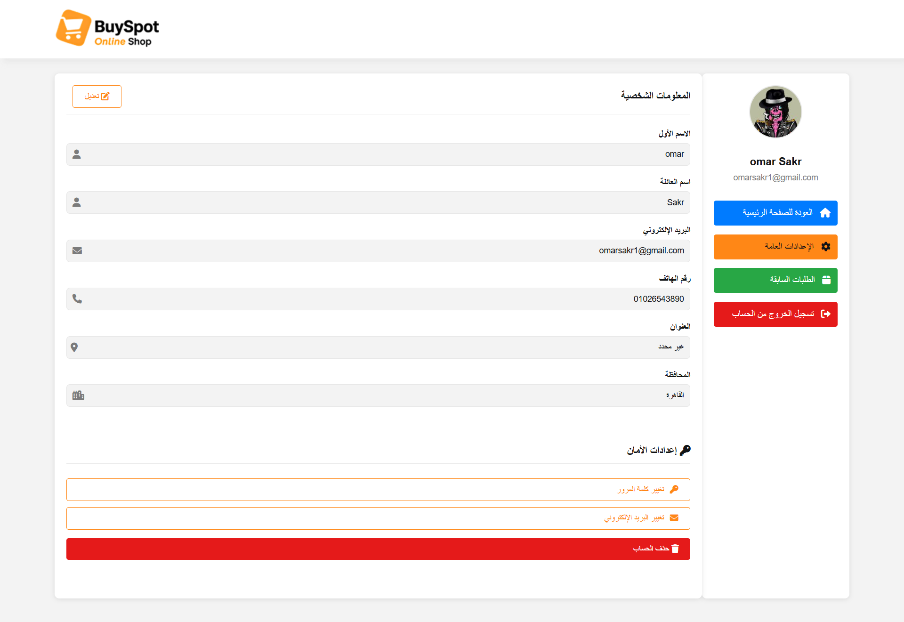

  <!-- Row 4 -->
  <br>
  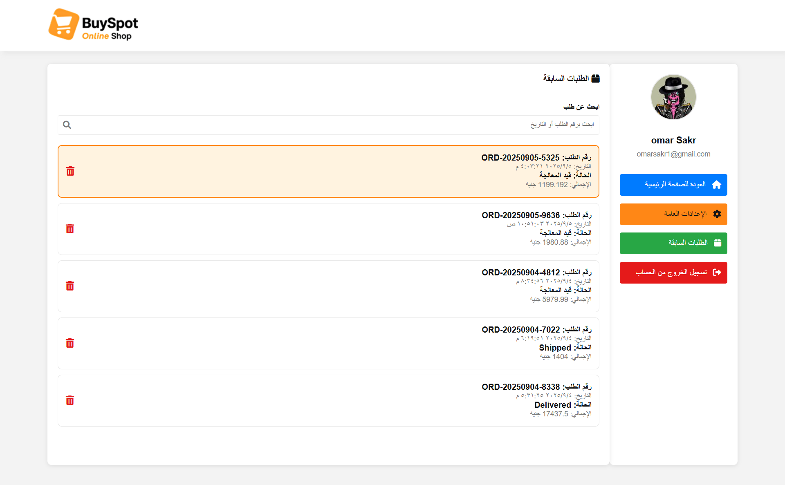
  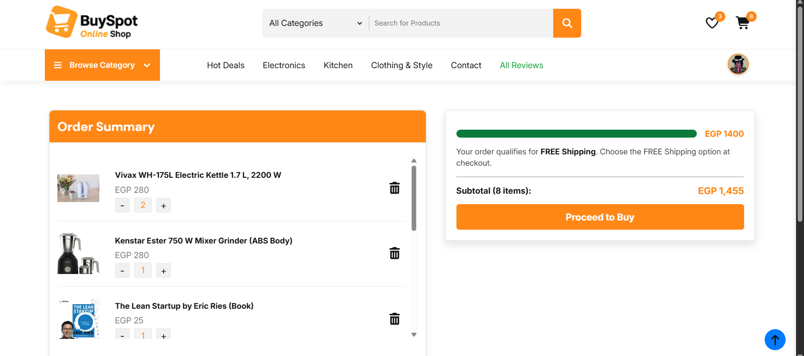
  

  <!-- Row 5 -->
  <br>
  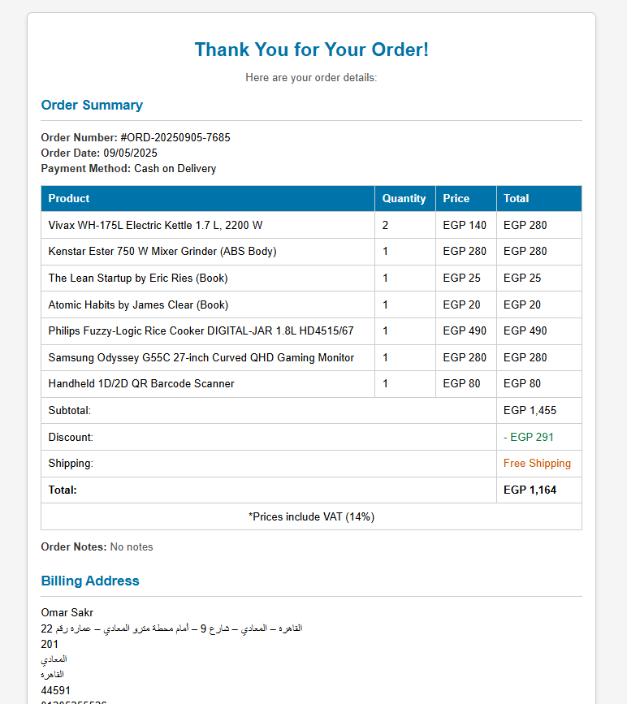
  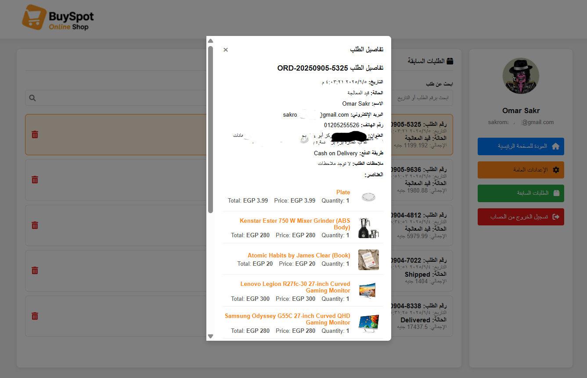
  

  <!-- Row 6 -->
  <br>
  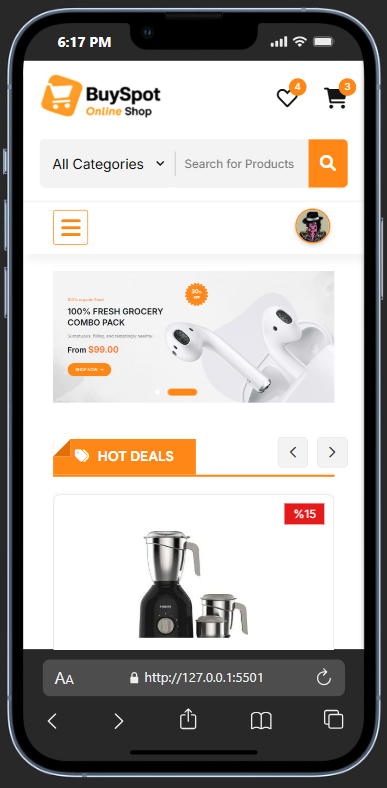

</div>


---

## 📑 Table of Contents

- [🌐 Live Demo](#-live-demo)
- [🚀 Features](#-features)
- [🧑‍💻 Technologies Used](#-technologies-used)
- [📂 Project Structure](#-project-structure)
- [🔧 Installation](#-installation)
- [⚙️ Usage](#️-usage)
- [🛠️ Challenges & Solutions](#️-challenges--solutions)
- [📌 Future Improvements](#-future-improvements)
- [📢 Known Issues](#-known-issues)
- [🤝 Contributing](#-contributing)
- [📪 Feedback](#-feedback)
- [📜 License](#-license)

---

## 🌐 Live Demo

Check out the live demo of **BuySpot Store** at 👉 [BuySpot Store Demo](https://your-demo-link.com)

---

## 🚀 Features

- 🛍️ **Product Browsing:** Explore 253 products across multiple categories.
- 🛒 **Cart & Favorites Management:** Persistent storage with localStorage.
- 🔎 **Search with Autocomplete:** Real-time suggestions in English & Arabic.
- 👤 **User Authentication:** Simple login/logout with profile image in header.
- ⭐ **Review System:** Submit, edit, and delete reviews with star ratings.
- 💳 **Checkout Process:** Cash on Delivery supported.
- ⚙️ **Profile Management:** Update name, image, and settings.
- 🎠 **Interactive UI:** Product sliders powered by Swiper.
- 📱 **Responsive Design:** Optimized for desktop & mobile.
- 🌐 **Bilingual Support:** English & Arabic UI + search.

---

## 🧑‍💻 Technologies Used

- **HTML5:** Structure & content.
- **CSS3:** Styling with responsive design.
- **JavaScript (Vanilla):** Dynamic functionality & validation.
- **Swiper (v11.0.5):** Product sliders.
- **SweetAlert2 (v11.14.1):** Custom alerts.
- **Font Awesome (v6.6.0):** Icons.
- **LocalStorage:** Persistent data management.
- **JSON:** Product data (253 products).
- **VS Code + Live Server:** Development tools.

📦 **Dependencies**

- [Swiper](https://cdn.jsdelivr.net/npm/swiper@11/swiper-bundle.min.js)
- [SweetAlert2](https://cdn.jsdelivr.net/npm/sweetalert2@11)
- [Font Awesome](https://cdnjs.cloudflare.com/ajax/libs/font-awesome/6.0.0-beta3/css/all.min.css)

---

## 📂 Project Structure

```
BuySpot_Store/
├── Assets/
│   ├── CSS/
│   │   ├── PrintOrder.css
│   │   ├── product_details.css
│   │   ├── Secure_Shopping.css
│   │   ├── settingsProfile.css
│   │   ├── Signup_Login.css
│   │   ├── style.css
│   ├── img/
│   │   ├── product/ (253 product images)
│   │   ├── screenshots/ (16 screenshots)
│   │   ├── Avatar.webp
│   │   ├── banner3_1.png
│   ├── JS/
│   │   ├── Checkoutdetails.js
│   │   ├── comments.js
│   │   ├── ForgotPassword.js
│   │   ├── items_home.js
│   │   ├── Login.js
│   │   ├── main.js
│   │   ├── PrintOrder.js
│   │   ├── products_list.js
│   │   ├── product_details.js
│   │   ├── Signup.js
│   │   ├── Swiper.js
│   │   ├── user-data-sync.js
├── pages/
│   ├── Checkoutdetails.html
│   ├── comments.html
│   ├── ForgotPassword.html
│   ├── Login.html
│   ├── PrintOrder.html
│   ├── ProceedToBuy.html
│   ├── products_list.html
│   ├── product_details.html
│   ├── settings.html
│   ├── Sign_UP.html
├── index.html
├── products.json
└── README.md

```

---

## 🔧 Installation

1- **Clone the repository**

```bash
git clone https://github.com/your-username/BuySpot_Store.git
```

2- **Navigate to the project directory:**

```bash
cd BuySpot_Store
```

3- **Ensure `products.json` is in the root directory** with valid data, for example:

```json
{
  "id": 260,
  "img": "Assets/img/product/260_result.webp",
  "name": "LEGO Friends Heartlake City",
  "price": 59.99,
  "old_price": 79.0,
  "category": "toys",
  "description": "LEGO Friends Heartlake City is a creative building set for children aged 6 and up, including mini-doll figures, buildings, and accessories. Encourages imaginative role-play, storytelling,    and creative construction. Children can build, decorate, and enact everyday scenarios, fostering teamwork, problem-solving, and creativity in a playful learning environment.",
  "specifications": {
    "Brand": "LEGO",
    "Age": "6+ years",
    "Material": "Plastic",
    "Type": "Building Set",
    "Educational Value": "Develops creativity, teamwork, problem-solving, and imaginative play"
  },
  "stock": 40,
  "rating": 4.8,
  "sku": "LEGO-260",
  "tags": [
    "lego",
    "building set",
    "friends",
    "creative play",
    "imaginative play"
  ]
}
```

Open index.html in a modern browser or use a local server (e.g., VS Code Live Server) at http://127.0.0.1:5501.

---

## 📋 Requirements

- Modern browser (Chrome, Firefox, Edge).
- Internet connection for CDN libraries.
- `products.json` in the root directory.

---

## ⚙️ Usage

- 🛍️ **Browse Products**: Navigate categories or use the search bar with autocomplete.
- 🛒 **Add to Cart/Favorites**: Use header icons or product pages.
- ⭐ **Submit Reviews**: Log in and visit `pages/comments.html`.
- 💳 **Checkout**: Complete purchases via `pages/ProceedToBuy.html`.
- ⚙️ **Profile Management**: Update details in `pages/settings.html`.

---

## 🛠️ Challenges & Solutions

- **Hiding Profile Icon After Logout**

  - **Issue**: The **`#headerProfileImage`** icon remained visible after logout due to UI update issues.
  - **Solution**: Updated **`handleUserLogout`** and **`updateUI`** in **`user-data-sync.js`** to clear **`this.currentUser`** and hide the icon using the **`hidden`** class.

- **Permissions Policy (unload) Error**

  - **Issue**: **`Permissions policy violation: unload`** is not allowed during logout redirects.
  - **Solution**: Replaced **`window.location.href`** with **`window.location.replace`** in **`handleUserLogout`**.

- **Cart & Favorites Management**

  - **Issue**: Needed better organization for post-logout data.
  - **Solution**: Used **`postLogoutTempCart`** and **`postLogoutTempFavorites`** in **`localStorage`** with a **7-day timestamp**.

- **Search Autocomplete Display**

  - **Issue**: Suggestions misaligned due to **ID mismatch** (**`search-text`** vs. **`search`**) and CSS errors.
  - **Solution**: Fixed **`comment.js`** to use **`id="search"`**, adjusted **`.suggestions`** CSS with  
    **`position: absolute; top: 100%; left: 0; right: 0;`**.

- **Large Product Data Loading**
  - **Issue**: Loading **`253 products`** from **`products.json`** slowed performance.
  - **Solution**: Proposed **Lazy Loading** or **Pagination** (_in progress_).

---

## 📌 Future Improvements

- 🌙 **Add Dark Mode support**
- 🌐 **Implement multi-language support** with _i18next_
- 📦 **Add order tracking functionality**
- ⚡ **Optimize performance** with _Lazy Loading_ + image compression
- 🔒 **Encrypt localStorage data** using _crypto-js_
- 🔎 **Add advanced search filters** (e.g., _price, ratings_)

---

## 📢 Known Issues

- ⚠️ **Loading 253 products** may cause delays on low-end devices (_Lazy Loading planned_).
- ⚠️ **Search autocomplete performance** may vary with large datasets.

---

## 🤝 Contributing

We welcome contributions! To contribute:

1- **Fork** the repository  
2- **Create a new branch**

```bash
git checkout -b feature/your-feature-name
```

3- **Commit changes:**

```bash
git commit -m 'Add new feature'
```

4- **Push to the branch:**

```bash
git push origin feature/your-feature-name
```

5- Submit a Pull Request.

Please follow the Code of Conduct and discuss changes via issues.

---

## 📪 Feedback

💡 Encounter **bugs** or have **suggestions**?  
Please use the **GitHub issue tracker** or contact:  
📧 [DevOmarHussien@gmail.com]

---

## 📜 License

Licensed under the **MIT License**.  
See the [LICENSE](./LICENSE) file for details.


